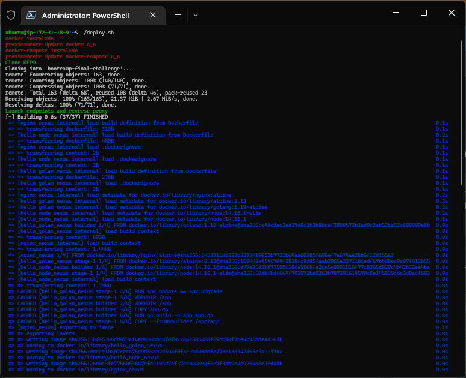

# Solución Bootcamp Final Challenge

se agrega carpeta ``deployment`` con archivos docker-compose.yml y .env ambos para usar con herramienta docker-compose
en el archivo.env la variabla ``ENV_NGINX_SET_WORKERS`` si se deja en 0 tomará la configuracion automatica de nginx que genera para lor workers, si se pone un valor arriba de cero entonces está sera la cantidad de workers habilitados.

de los tres servicios implementados en contenedores se hicieron los siguientes cambios

`hello-world-golang` - Golang REST endpoints
- app.go: se agrega linea para importar paquete os en linea 7. se agrega variable port en linea 11 y en linea 17 se hace uso de la variable port.
- dockerfile: se implementa contenedor con multistage para obtener un contenedor final reducido

`hello-world-nodejs` - Nodejs REST endpoint
- Dockerfile: se modifica para que sea multistage y obtener un contenedor de tamaño reducido.
- package.json: se modifica para agregar la linea 8 con script build para transpilar typescript, en linea 9 se cambia el script start para ejecutar el codigo transpilado
- tsconfig.json: se modifica la linea 22 agregando la libreria dom y se agrega la linea 24 con la configuracion noImplicitAny: false
- server/servert.ts: se agrega el uso de la variable port para el leer el valor PORT de variable de entorno en la linea 3, se modifica la linea 8 para el uso de la varible port y se cambió el ip de 127.0.0.1 a 0.0.0.0, así mismo en la linea 9 se agrega el uso de la variable port

`hello-world-nginx` - Nginx reverse proxy
se agrega nuevas carpetas para el despliegue de contenedor ngingx que cuenta con 
- carpeta script: para controlar los workers.
- carpeta templates: con el archivo base default.conf.template  en la linea 9 y 14 solo fue necesario usar ``^~`` antes de cada referencia para que redireccion de endpoints.
- se modifica el archivo dockerfile para que actualice sus componentes del sistema y agregue un nuevo scripts de inicio para poder controlar los workers, si deja en valor 0 , no afecta la configuracion previa realizada por el autocalculo de workers, si se define un valor arriba de cero fuerza la cantidad de workers a razon del valor especificado

## DevOps Challanges

- Desarrollar infraestructura como código que implementa los tres servicios en un entorno local "no necesario debemos tener acceso AWS podemos armar los recursos y tenerlos listo", si cuentas con acceso alguna nube podrias desplegarlo alli.   

    en la carpeta ``Launcher`` se encuentra el archivo ``deploy.sh`` 
    
      wget https://github.com/wnervhq/bootcamp-final-challenge/blob/d2650dbcaf4c9e45c5c49f431d25185ec679b1b7/Launcher/deploy.sh

    

- Diseño de Docker-Compose que permita tener los tres servicios en un entorno de desarrollo
        
    en la carpeta ``deployment`` se encuentra el archivo docker-compose.yml

- Diseñar CICD con Github Action que permita desplegar a DockerHub la aplicacion node y golang  
    
    se agregaron dos archivos para cada uno de los despliegues que se encuentran en la carpeta .github/workflows
        
        - pipeline_deploy_DockerHub_node.yml
        - pipeline_deploy_DockerHub_golang.yml

       

- Cree e implemente todas las aplicaciones en un solo comando *tips Automatiza

    en la carpeta ``Launcher`` se encuentra el archivo ``deploy.sh`` 
    
      wget https://github.com/wnervhq/bootcamp-final-challenge/blob/d2650dbcaf4c9e45c5c49f431d25185ec679b1b7/Launcher/deploy.sh

       
       
       
       

- Asegúrese de que el proxy nginx esté configurado correctamente para representar ambas aplicaciones.   

    https://github.com/wnervhq/bootcamp-final-challenge/blob/d2650dbcaf4c9e45c5c49f431d25185ec679b1b7/hello-world-nginx/templates/default.conf.template#L1

- Revisar las aplicaciones para la preparación de la producción.

## Time

Dedique un máximo de tres (3) horas para completar el trabajo que considere que representa sus habilidades de DevOps. Si pasa más de tres (3) horas, registre el tiempo que pasó y proporcione detalles, pueden usar trello. 

Parte del ejercicio es ver cómo prioriza el trabajo y lo divide en partes manejables "divides y venceras"

    respecto al time, me tomó mas tiempo darme cuenta que debía transpilar el codigo de typescript y conseguir que corriera correctamente.
    Buscar que el proxy reverso redireccionara a los endpoints sin necesidad de especificar uno por uno tambien me tomó algo de tiempo buscar pero di con el codigo adecuado.
    Tuve problemas con el los pipelines debido a que en el repositorio se maneja subcarpetas por cada endpoint pero revisando la documentación pude solucionar.
    En el caso del endpoint en golang el uso del template fue facil de acuerdo de la documentacion pero me tomo algo de tiempo poder encontrar la formar de controlar los workers pero tambien revisando la documentacion me di cuenta de la carpeta entrypoint.sh que se usa y alli fue donde adicioné mi archivo 40-mod_nginx.sh